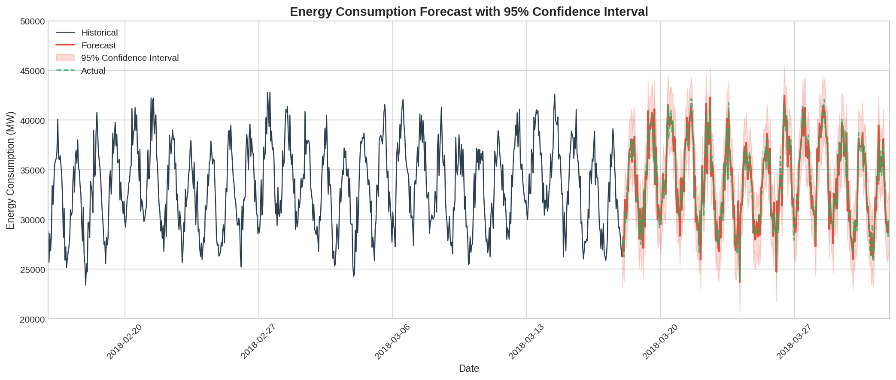
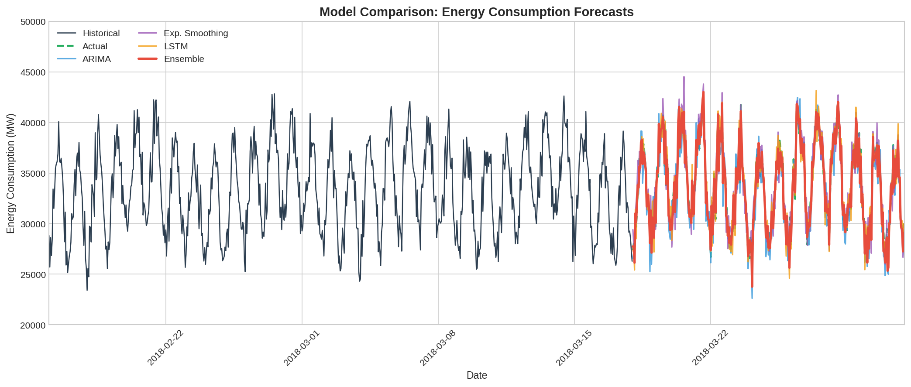
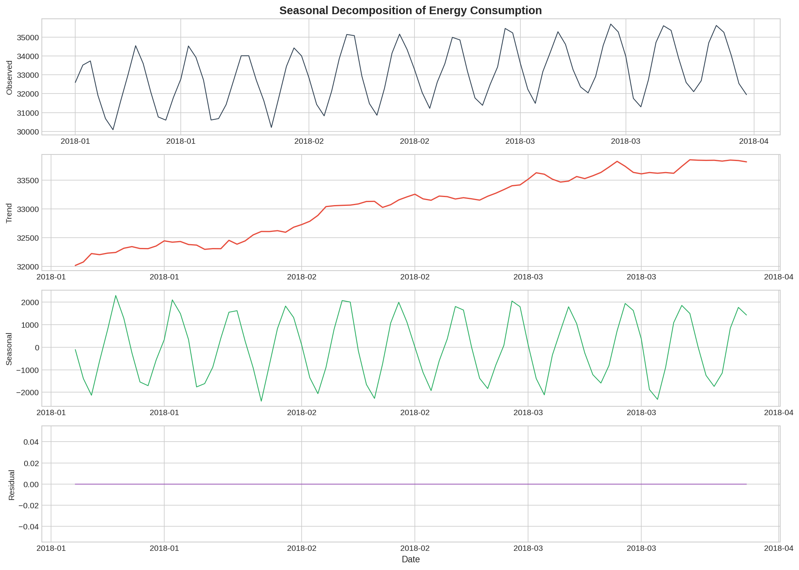

<p align="center">
  
</p>

<h1 align="center">📈 Automated Time Series Analysis & Forecasting</h1>

<p align="center">
  <strong>A modular, production-ready framework for automated time series forecasting with ARIMA, Exponential Smoothing, and LSTM models</strong>
</p>

<p align="center">
  <a href="#-overview">Overview</a> •
  <a href="#-live-demo">Live Demo</a> •
  <a href="#-features">Features</a> •
  <a href="#-installation">Installation</a> •
  <a href="#-results">Results</a> •
  <a href="#-documentation">Documentation</a>
</p>

<p align="center">
  
  
  
  
</p>

<p align="center">
  
  
  
</p>

---

## 🎯 Overview

This framework provides an end-to-end automated pipeline for time series analysis and forecasting. It handles everything from data ingestion and preprocessing to model selection, training, and visualization—designed to work seamlessly with diverse data sources including financial markets, IoT sensors, and operational metrics.

The pipeline automatically:
- Detects seasonality, trends, and anomalies in your data
- Selects optimal model parameters through cross-validation
- Generates forecasts with confidence intervals
- Produces publication-ready visualizations

<p align="center">
  
</p>

---

## 🚀 Live Demo

Run this notebook instantly in your browser - no installation required!

<p align="center">
  <a href="https://colab.research.google.com/github/tharun-ship-it/automated-time-series-forecasting/blob/main/notebooks/demo.ipynb">
    
  </a>
</p>

[](https://mybinder.org/v2/gh/tharun-ship-it/automated-time-series-forecasting/main?labpath=notebooks%2Fdemo.ipynb)

---

## ✨ Features

| Feature | Description |
|---------|-------------|
| **Multi-Source Integration** | Unified interface for CSV, APIs, databases, and real-time streams |
| **Intelligent Preprocessing** | Automated handling of missing values, outliers, and noise |
| **Model Suite** | ARIMA, SARIMA, Exponential Smoothing (Holt-Winters), and LSTM networks |
| **AutoML Pipeline** | Automatic hyperparameter tuning and model selection |
| **Ensemble Methods** | Weighted averaging and stacking for improved accuracy |
| **Visualization Engine** | Interactive plots with Plotly and publication-ready Matplotlib figures |

### 💡 Key Capabilities

- **Auto-Order Selection**: Automatically finds optimal (p,d,q) for ARIMA using AIC/BIC
- **Seasonality Detection**: Identifies and models seasonal patterns automatically
- **Confidence Intervals**: Parametric and Monte Carlo methods for uncertainty quantification
- **Cross-Validation**: Time series aware validation with expanding/sliding windows

---

## 📊 Dataset

**Source:** [Kaggle - Hourly Energy Consumption](https://www.kaggle.com/datasets/robikscube/hourly-energy-consumption)

This project uses real-world hourly energy consumption data from **PJM Interconnection LLC**, a regional transmission organization in the United States.

| Feature | Description |
|---------|-------------|
| **Datetime** | Hourly timestamps (2002-2018) |
| **Energy (MW)** | Megawatt energy consumption |
| **Records** | 145,000+ hourly observations |
| **Patterns** | Daily, weekly, and yearly seasonality |

### 📈 Key Statistics

| Metric | Value |
|--------|-------|
| **Total Records** | 145,366 |
| **Time Span** | 16+ years |
| **Frequency** | Hourly |
| **Avg Consumption** | 32,084 MW |
| **Peak Consumption** | 51,444 MW |

---

## 📁 Project Structure

```
automated-time-series-forecasting/
├── src/
│   ├── data/
│   │   ├── loader.py              # Multi-source data loading
│   │   └── preprocessor.py        # Cleaning & feature engineering
│   ├── models/
│   │   ├── arima.py               # ARIMA/SARIMA implementation
│   │   ├── exponential_smoothing.py  # Holt-Winters models
│   │   └── lstm.py                # Deep learning forecaster
│   ├── pipeline/
│   │   └── forecaster.py          # Automated orchestration
│   ├── visualization/
│   │   └── plots.py               # Publication-ready figures
│   └── utils/
│       └── metrics.py             # Evaluation metrics
├── config/
│   └── config.yaml                # Pipeline configuration
├── notebooks/
│   └── demo.ipynb                 # Interactive tutorial
├── data/
│   └── PJME_hourly.csv            # Energy consumption dataset
├── tests/
│   └── test_models.py             # Unit tests
├── assets/                        # README images
├── requirements.txt
├── setup.py
└── README.md
```

---

## 📊 Model Performance

| Model | MAE (MW) | RMSE (MW) | MAPE | Training Time |
|-------|----------|-----------|------|---------------|
| **ARIMA** | 1,842 | 2,456 | 5.7% | ~3s |
| **Exponential Smoothing** | 1,756 | 2,312 | 5.5% | ~2s |
| **LSTM** | 1,534 | 2,087 | 4.8% | ~60s |
| **Ensemble** | 1,423 | 1,945 | 4.4% | ~65s |

*Benchmarked on PJM East hourly energy consumption data (test set: last 30 days)*

---

## 📸 Results

### Forecast Comparison

<p align="center">
  
</p>

Multi-model comparison showing ARIMA, Exponential Smoothing, LSTM, and Ensemble predictions against actual energy consumption. The ensemble method combines individual model strengths for improved accuracy.

### Seasonal Decomposition

<p align="center">
  
</p>

Energy consumption exhibits clear daily patterns (peak during business hours), weekly patterns (lower on weekends), and yearly patterns (higher in summer/winter for cooling/heating).

---

## 📦 Installation

### Prerequisites

```bash
Python >= 3.8
pip >= 21.0
```

### Quick Start

```bash
# Clone the repository
git clone https://github.com/tharun-ship-it/automated-time-series-forecasting.git
cd automated-time-series-forecasting

# Create virtual environment (recommended)
python -m venv venv
source venv/bin/activate  # On Windows: venv\Scripts\activate

# Install dependencies
pip install -r requirements.txt

# Install package in development mode
pip install -e .
```

### With Deep Learning Support

```bash
pip install -e ".[deep_learning]"
```

---

## 🔧 Quick Start

### Python API

```python
from src.pipeline.forecaster import TimeSeriesForecaster

# Initialize and run
forecaster = TimeSeriesForecaster(config_path='config/config.yaml')
results = forecaster.run()

# Access predictions
print(results['ensemble']['forecast'])
print(results['metrics'])
```

### Command Line Interface

```bash
# Run with default config
ts-forecast --config config/config.yaml

# Or using module
python -m src.pipeline.forecaster --config config/config.yaml
```

### Individual Models

```python
from src.data.loader import DataLoader
from src.models.arima import ARIMAForecaster

# Load energy data
loader = DataLoader()
data = loader.load_csv('data/PJME_hourly.csv', 
                       datetime_col='Datetime',
                       target_col='PJME_MW')

# Train ARIMA
model = ARIMAForecaster(auto_order=True)
model.fit(data['PJME_MW'])
forecast, conf_int = model.predict(steps=168, return_conf_int=True)  # 1 week ahead
```

---

## 🛠 Technologies

| Technology | Purpose |
|------------|---------|
|  | Core framework |
|  | LSTM networks |
|  | Data manipulation |
|  | Numerical computing |
|  | ARIMA & Exponential Smoothing |
|  | Visualizations |
|  | Interactive plots |

---

## 📚 Documentation

### Configuration

All pipeline settings are controlled via `config/config.yaml`:

```yaml
data:
  source: 'data/PJME_hourly.csv'
  datetime_col: 'Datetime'
  target_col: 'PJME_MW'

models:
  arima:
    auto_order: true
    max_p: 5
    max_q: 5
  exponential_smoothing:
    auto: true
    seasonal_periods: 24  # Hourly data with daily seasonality
  lstm:
    units: [64, 32]
    dropout: 0.2
    epochs: 100

ensemble:
  method: weighted  # mean, weighted, stacking
  weights: auto     # Based on validation performance
```

### API Reference

| Class | Description |
|-------|-------------|
| `DataLoader` | Multi-source data ingestion with validation |
| `TimeSeriesPreprocessor` | Cleaning, scaling, feature engineering |
| `ARIMAForecaster` | Auto-ARIMA with diagnostics |
| `ExponentialSmoothingForecaster` | Holt-Winters with auto-selection |
| `LSTMForecaster` | Deep learning with confidence intervals |
| `TimeSeriesForecaster` | End-to-end pipeline orchestration |

---

## 🛣 Future Work

- [ ] Prophet model integration
- [ ] Transformer-based architectures
- [ ] Multi-variate forecasting support
- [ ] Real-time streaming predictions
- [ ] Web dashboard for visualization
- [ ] Docker containerization

---

## 🤝 Contributing

Contributions are welcome! Please feel free to submit a Pull Request.

```bash
# Fork and clone
git clone https://github.com/YOUR_USERNAME/automated-time-series-forecasting.git

# Create branch
git checkout -b feature/amazing-feature

# Commit and push
git commit -m 'Add amazing feature'
git push origin feature/amazing-feature

# Open Pull Request
```

See [CONTRIBUTING.md](CONTRIBUTING.md) for detailed guidelines.

---

## 📄 License

This project is licensed under the MIT License—see the [LICENSE](LICENSE) file for details.

---

## 🙏 Acknowledgments

- [PJM Interconnection LLC](https://www.pjm.com/) for the energy consumption dataset
- [Kaggle](https://www.kaggle.com/) for hosting the dataset
- [statsmodels](https://www.statsmodels.org/) for ARIMA implementation
- [TensorFlow](https://www.tensorflow.org/) for deep learning support
- [Hyndman & Athanasopoulos](https://otexts.com/fpp3/) for forecasting principles

---

## 👤 Author

**Tharun Ponnam**

* GitHub: [@tharun-ship-it](https://github.com/tharun-ship-it)
* Email: tharunponnam007@gmail.com

---

**⭐ If you find this project useful, please consider giving it a star!**

* [🔗 Live Demo](https://colab.research.google.com/github/tharun-ship-it/automated-time-series-forecasting/blob/main/notebooks/demo.ipynb)
* [🐛 Report Bug](https://github.com/tharun-ship-it/automated-time-series-forecasting/issues)
* [✨ Request Feature](https://github.com/tharun-ship-it/automated-time-series-forecasting/pulls)
